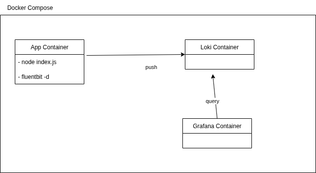
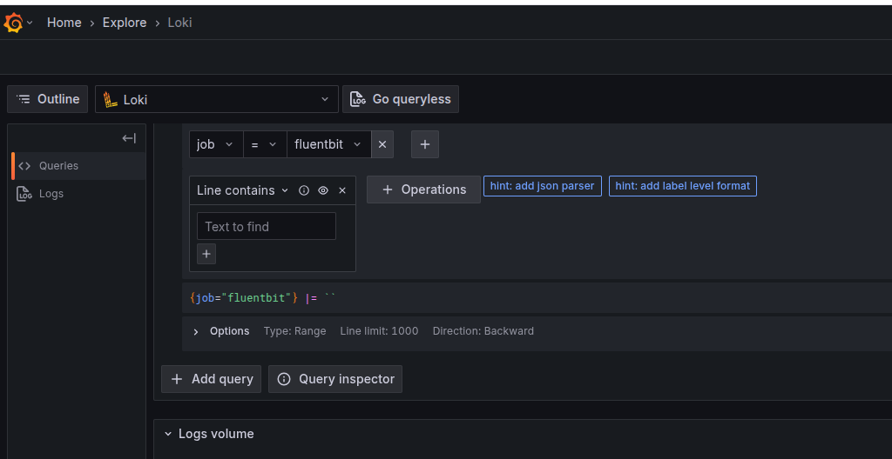

# Fluentbit Playground Project

Objective: 
- To create an orchestration of containers to mimic a usual logging 
and metrics setup. 
- To have a playgraound where change and test different components withint the logging and metrics environment

### Diagram

###  Setup

1. `docker compose up`
2. Open in a browser `http://localhost:3000`
3. Set a new password for the  `admin` user (the current one is `admin`)
4. Go to `http://localhost:3000/explore` and select in the Dropdown *Loki* and run a query. 

5. Run any of the two endpoints below and check the query again. You should see the logs from that call

###  Endpoints 

**Success endpoint** 

    curl --location --request GET 'http://localhost:8080/success' \
    --header 'Content-Type: application/json' 

**Fail endpoint**

    curl --location --request GET 'http://localhost:8080/fail' \
    --header 'Content-Type: application/json'     
